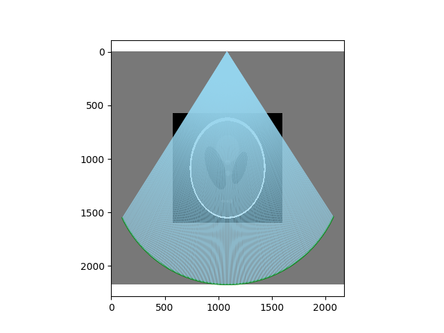
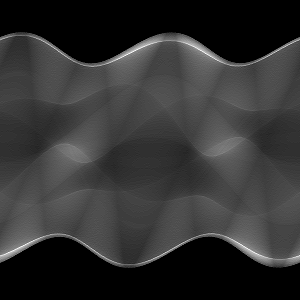
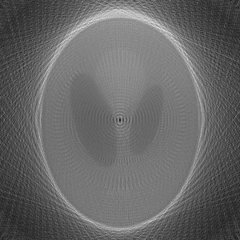
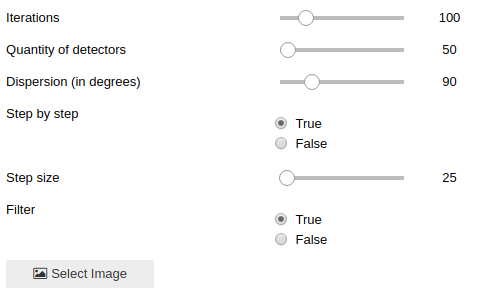

# iwm_tomograph

### Installation
```
conda create -n iwm python=3.6 anaconda
conda activate iwm
``` 

##### Add widgets
With pip:
```
pip install ipywidgets
jupyter nbextension enable --py widgetsnbextension
```

With conda:
```
conda install -c conda-forge ipywidgets
```

### Steps

Load an image


Place the image in bigger image. Calculate positions of and emiter and detectors, calculate lines between devices using bresnhman algorithm.



Create singoram column using average value of every line. Move devices and repeat for every degree.



Construct image from averages of lines using sinogram.


 
 ### GUI
 
